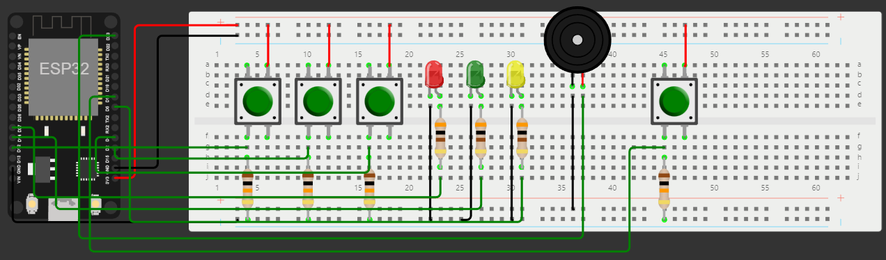

   
Despertador Simon 

 

## :pushpin: Descrição

Despertador que para desativar o alarme você joga simon says com cores, usando leds, e botões. O usuário deverá ver qual sequência de leds acende e apertar os respectivos botões na ordem certa para que o despertador pare de tocar.

 

## :robot: Montagem do dispositivo físico

### Lista de materiais

| Quantidade | Nome | Link para referência |
| --- | --- | --- |
| 1 | ESP32 e cabo USB | https://www.baudaeletronica.com.br/placa-doit-esp32-bluetooth-e-wifi.html |
| 4 | Botões | https://www.circuitofacil.com.br/produto/botao-push-6x6x5mm/ |
| 3 | Leds | https://www.tecnotronics.com.br/led-azul-difuso-5mm.html |
| 1 | Protoboard | --- |
| 1 | Buzzer | https://www.tecnotronics.com.br/buzzer-ativo-5v-bip-continuo.html#tab-description |
| 3 | Resistores 300 ohms | --- |
| 4 | Resistores 10k ohms | --- |

### Lista de conexões

| Componente | Pino da placa |
| --- | --- |
| Sensor de Toque A | 21 |
| Sensor de Toque B | 19 |
| Sensor de Toque C | 23 |
| Sensor de Toque D | 22 |
| Sensores de temperatura | 4 |

### Funcionamento dos sensores e atuadores

#### Buzzer 5V

O buzzer é um atuador que integra transdutores eletrônicos, tendo como principal tarefa a emissão de som, podendo funcionar como alarme, aviso ou até mesmo ser usado para reproduzir uma melodia.
O funcionamento acontece ao conectá-lo à placa, que fornecerá energia ao buzzer, e o comando de determinada tarefa será passado. (Especificações: https://www.tecnotronics.com.br/buzzer-ativo-5v-bip-continuo.html#tab-description)

Características: 
- Buzzer Ativo 5V Bip Contínuo
- Emissão de sinais sonoros em frequência única
- Ativado por energia DC
- Ideal para protoboard
- Compatível com Arduino, AVR, PIC, AMR, Raspberry PI, etc

Especificações:
- Tensão de trabalho: 4 a 8V
- Tensão recomendada: 5V
- Corrente máxima: 40mA
- Diâmetro: 12mm
- Altura: 10mm
- Peso: 1,6g
- Peso com embalagem: 1,8g

#### Leds 

O led é um diodo que emite luz, usado como sinalizador, fonte luminosa ou de alerta. Possui o terminal positivo e negativo, chamados de cátodo e ânodo, que funcionam de modo a viabilizar ou não a passagem de energia e, consequentemente, a emissão de luz. Para identificação, a "perna" de maior comprimento é o terminal positivo e o de menor é o negativo. (Especificações: https://www.tecnotronics.com.br/led-azul-difuso-5mm.html)

Características:
- Componente bipolar (ânodo e cátodo);
- Ordem de conexão específica;
- Bulbo incolor;
- Terminal de maior comprimento positivo;
- Terminal de menor comprimento negativo;
- Chip Semicondutor integrado;
- Maior economia de energia;
- Tamanho reduzido;
- Maior tempo de vida útil;
- Confiabilidade e extrema durabilidade;
- 1 unidade.

Especificações:
- Tensão de alimentação: 3.2 ~3.8V;
- Luminosidade: 20.000 MCD;
- Corrente máxima: 25mA;
- Ângulo de abertura: 20º ~ 30°;
- Diâmetro do LED: 5mm;
- Comprimento: 37mm;
- Peso unidade: 0,3g.

### Circuito

Figura - Diagrama do circuito 
   

Informações importantes sobre o circuito, onde colocá-lo, entre outros.
 

 

## :electric_plug: Funcionamento do sistema
*É necessária a versão 1.20 do Micropython*

**(esquecemos de gravar o vídeo :(  )**

- O sistema inicia o servidor, que irá servir uma página web para o usuário inserir o horário do alarme
  - Se o horário inserido já passou no dia, o alarme fica definido para o dia seguinte
- O código espera o tanto de segundos que faltam para o alarme, e então, quando chega o horário, o alarme (toque reproduzido pelo buzzer) começa
- Para iniciar o jogo, o usuário deve pressionar o botão
  - Quando o jogo é iniciado, um led piscará. E então, o usuário deve pressionar o botão correspondente ao led que piscou. Assim, o led que piscou inicialmente piscará de novo, seguido de um outro led. Então o usuário deverá apertar os botões referentes aos dois leds, na sequência em que piscaram. Esse padrão se repete até que o jogo seja ganho
  - Cada vez que o usuário acerta uma sequência, ele ganha um ponto. Ao ganhar 5 pontos o jogo acaba. Porém, ao cometer um erro, seus pontos voltam a 0 e a sequência volta a ser composta por apenas um led
- Quando o usuário ganha o jogo, os leds param de piscar e o alarme para de tocar.

 

## :busts_in_silhouette: Contribuir no projeto

### Features implementadas

- [x] Definição de alarme, por um site, para um horário dentro das próximas 24h
- [x] Jogo com 3 leds de cores diferentes
- [x] Tocar o alarme quando o jogo inicia, e parar quando o jogo for vencido

### Features para incrementar no projeto

- [ ] Possibilidade de configurar alarme para qualquer dia, e definir sua repetição durante a semana
- [ ] Possibilidade do usuário escolher entre uma lista de toques disponíveis no site